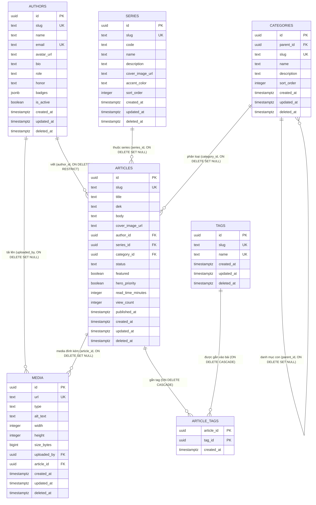

# TNC Platform v2.0 — Database Architecture Review

**Phạm vi:** review kiến trúc `database/schema.sql` (đã seed/test ở bước trước) trước khi deploy lên Supabase production. **Không có thay đổi schema nào được thực hiện trong tài liệu này** — đây thuần là đánh giá + đề xuất.

**Trạng thái tại thời điểm review:** schema có 7 bảng (`authors`, `categories`, `series`, `tags`, `articles`, `article_tags`, `media`), đã seed dữ liệu mẫu và pass toàn bộ test suite (`test.sql`), nhưng **chưa deploy lên Supabase**.

---

## 1. Tổng quan

Schema hiện tại được thiết kế cho **một hệ thống biên tập nội dung (editorial CMS)** — đúng phạm vi 7 bảng đã yêu cầu ban đầu: tác giả, chuyên mục, tuyến nội dung, từ khóa, bài viết, liên kết bài-viết-từ-khóa, và thư viện media. Nó KHÔNG (và chưa từng được yêu cầu) bao gồm bất kỳ khái niệm nào về **người dùng đầu cuối** (độc giả, thành viên, tài khoản đăng nhập) hay các tính năng tương tác (bookmark, comment, notification...).

Đây là điểm quan trọng nhất cần nắm trước khi đọc phần đánh giá bên dưới: **schema đang ở trạng thái "lõi biên tập" (editorial core), chưa phải "nền tảng toàn diện" (full platform)**. Phần lớn nhận định trong review này xoay quanh khoảng cách giữa 2 trạng thái đó.

---

## 2. ERD (Entity Relationship Diagram)

*(Ghi chú ký hiệu: `article_tags.article_id` và `article_tags.tag_id` đều vừa là PK thành phần vừa là FK — Mermaid erDiagram chỉ hiển thị 1 nhãn khóa/cột nên đánh dấu PK ở sơ đồ, chiều FK thể hiện qua các quan hệ phía dưới.)*

---

## 3. Đánh giá

### 3.1 Điểm mạnh

1. **Soft-delete nhất quán trên mọi bảng thực thể** (`deleted_at`), kết hợp **partial unique index** (`WHERE deleted_at IS NULL`) thay vì `UNIQUE` thường — cho phép tái sử dụng slug/email/url sau khi xoá mềm mà không mất tính duy nhất khi còn hoạt động. Đã kiểm chứng thực nghiệm trong `test.sql`, không chỉ thiết kế trên giấy.
2. **`updated_at` tự động qua 1 trigger function dùng chung** (`set_updated_at()`) — DRY, nhất quán, không phụ thuộc tầng ứng dụng nhớ cập nhật.
3. **UUID làm khóa chính** — không lộ số lượng bản ghi qua ID tuần tự, thuận lợi cho API công khai, import dữ liệu từ nhiều nguồn, và không có xung đột ID khi hợp nhất dữ liệu sau này.
4. **CHECK constraint thay vì `ENUM` gốc của Postgres** cho các cột trạng thái (`role`, `status`, `type`) — mở rộng giá trị chỉ cần sửa 1 dòng CHECK, không cần `ALTER TYPE` (vốn có nhiều hạn chế trong Postgres, đặc biệt không thể xoá giá trị enum).
5. **Quy tắc `ON DELETE` được cân nhắc đúng theo ngữ nghĩa quan hệ**: `RESTRICT` cho quan hệ sở hữu nội dung (`articles.author_id`), `SET NULL` cho quan hệ phân loại/gắn nhãn (`series_id`, `category_id`, `media.*`), `CASCADE` cho bảng nối thuần (`article_tags`) — không dùng mặc định `NO ACTION` một cách máy móc.
6. **RLS bật sẵn với policy đọc công khai baseline** — đúng khuyến nghị bảo mật-mặc định của Supabase; hiện tại chỉ `service_role` ghi được, giảm rủi ro lộ quyền ghi trước khi có hệ thống xác thực thật.
7. **`categories` hỗ trợ phân cấp** (`parent_id` tự tham chiếu) — thiết kế có tầm nhìn, không cần sửa schema khi cần chuyên mục con.
8. **`media` tách biệt khỏi `articles`** (không cascade xoá) — cho phép tái sử dụng cùng 1 ảnh cho nhiều mục đích và giữ thư viện media không bị mất khi một bài viết bị xoá.
9. **Bộ test.sql thực nghiệm, không chỉ lý thuyết** — mọi ràng buộc (FK/Unique/Check/Soft delete/Cascade/Trigger/Partial unique/RLS) đều đã được chạy thật và pass trên Postgres 16, giảm rủi ro "trông đúng trên giấy nhưng sai khi chạy thật".
10. **Không có bảng/cột nào thực sự "chết"** — audit toàn bộ 7 bảng không phát hiện cột không dùng hay bảng thừa; schema khá gọn cho đúng phạm vi đã đặt ra.

### 3.2 Điểm có thể gây khó mở rộng sau này

1. **Không có khái niệm "user" (người dùng cuối) tách biệt khỏi "author" (biên tập viên).** Đây là khoảng trống lớn nhất — gần như mọi tính năng ở mục 4 bên dưới (Membership, Bookmark, Comment, User Profile, Notification) đều cần một bảng `users` (thường 1-1 với `auth.users` của Supabase) mà schema hiện tại hoàn toàn chưa có. `authors` không thể dùng thay thế vì nó đại diện cho ~5-10 biên tập viên, không phải hàng nghìn độc giả.
2. **`articles.category_id` là FK đơn (1 bài = tối đa 1 category)**, trong khi `tags` là N-N. Nếu sản phẩm muốn 1 bài thuộc nhiều category (khác với tag tự do), cần thêm bảng nối `article_categories` — hiện chưa hỗ trợ. *(Có thể đây là quyết định sản phẩm có chủ đích — xem đề xuất #2 ở mục 5, không tự sửa.)*
3. **`view_count` là 1 counter denormalized trên chính row `articles`.** Vấn đề kép:
   - Không có dữ liệu time-series (không biết xem lúc nào, từ đâu) — không đủ cho Analytics thật.
   - **Mỗi lần tăng view_count sẽ kích hoạt trigger `updated_at`**, khiến bài viết trông như "vừa được chỉnh sửa" dù chỉ là lượt xem — làm sai lệch mọi truy vấn/cache dựa trên `updated_at` (vd "bài mới cập nhật gần đây"). Đây là một lỗi thiết kế cụ thể, không phải suy đoán chung chung.
4. **`media` không phải là nguồn sự thật duy nhất cho ảnh.** `authors.avatar_url`, `series.cover_image_url`, `articles.cover_image_url` đều là cột `text` chứa URL trực tiếp, KHÔNG tham chiếu vào bảng `media` — trong khi `media` cũng có `article_id`/`uploaded_by` như thể nó là nơi quản lý ảnh chính thức. Kết quả: có **2 đường dẫn song song** để gắn ảnh vào một bài viết (URL thô trong cột `cover_image_url`, và một row `media` riêng trỏ `article_id` tới cùng bài đó) mà không có gì đảm bảo chúng nhất quán với nhau.
5. **Không có bảng `artists`.** "Artist Profile" (nghệ sĩ) là một thực thể hoàn toàn khác `authors` (biên tập viên) nhưng chưa tồn tại trong schema 7 bảng này — hiện chỉ có `tags` tự do (vd `#Binz`) có thể *ngụ ý* nghệ sĩ nhưng không mang được dữ liệu hồ sơ (tiểu sử, ảnh, mạng xã hội, trạng thái xác minh...).
6. **Không có full-text search index** (`tsvector`/GIN) — tìm kiếm hiện tại chỉ có thể làm bằng `ILIKE` (chậm, không xếp hạng độ liên quan).
7. **`authors.honor` (text đơn) và `authors.badges` (jsonb mảng)** là 2 cách mô hình hóa khác nhau cho cùng một loại dữ liệu ("ghi nhận/vinh danh") — không nhất quán, và cả hai đều là dữ liệu tự do (không FK ra registry) nên không đảm bảo toàn vẹn tham chiếu (gõ sai id badge vẫn được lưu bình thường).
8. **Không có bảng ghi lịch sử phiên bản bài viết** (revision/version) — sửa `body` là ghi đè trực tiếp, mất khả năng xem lại bản trước hoặc khôi phục.
9. **Không có bảng slug-history/redirect** — đổi `slug` của 1 bài đã publish sẽ làm URL cũ 404 (rủi ro SEO), không có cơ chế lưu vết slug cũ để redirect.
10. **RLS mới chỉ có policy đọc (SELECT).** Không có policy ghi theo `auth.uid()` — hiện tại chỉ `service_role` ghi được. Khi có hệ thống đăng nhập biên tập viên thật (không phải qua service_role), cần bổ sung policy ghi phân theo `authors.role`, hiện chưa có nền tảng để làm việc đó (vì chưa có bảng `users`/liên kết `auth.users`).
11. **PostgREST (API tự động của Supabase) sẽ expose trực tiếp các bảng gốc** nếu không có VIEW riêng — nghĩa là nếu bật Public API ngay bây giờ, các cột nội bộ (`deleted_at`, `view_count` thô, `email` của tác giả...) đều có nguy cơ lộ ra ngoài trừ khi RLS + column-level grant được cấu hình rất cẩn thận, hoặc tạo VIEW công khai riêng.

### 3.3 Các cột hoặc bảng dư thừa

Sau khi rà soát toàn bộ 7 bảng: **không phát hiện bảng nào dư thừa/không dùng**, và hầu hết cột đều có mục đích rõ ràng. Một vài điểm nhỏ đáng lưu ý (không phải "thừa" theo nghĩa xoá được ngay, mà là *mô hình hóa chưa nhất quán*):

- `authors.honor` (scalar) vs `authors.badges` (mảng) — như đã nêu ở 3.2 mục 7, nên hợp nhất cách biểu diễn (hoặc cả hai đều thành registry table, xem đề xuất #7).
- `series.accent_color` là `text` tự do — hiện chỉ dùng 2 giá trị (`red`/`gold`) theo seed data, có thể ràng buộc bằng CHECK nếu chắc chắn danh sách màu cố định, nhưng **không khẩn cấp** (rủi ro thấp, chỉ ảnh hưởng hiển thị).
- `articles.featured` và `articles.hero_priority` **trông có vẻ trùng lặp nhưng KHÔNG dư thừa** — đây là 2 tín hiệu biên tập khác nhau đã có ý nghĩa sản phẩm rõ ràng từ hệ thống website tĩnh hiện tại (`featured` = bài được biên tập chọn nổi bật nói chung; `hero_priority` = ưu tiên chọn vào vị trí Hero trang chủ, có thuật toán chọn riêng). Nêu ra để tránh hiểu lầm là lỗi trùng lặp khi review lần sau.

### 3.4 Các quan hệ có thể tối ưu

1. **`media` vs. các cột `*_image_url` trực tiếp** (mục 3.2 #4) — đây là quan hệ đáng tối ưu nhất. Cần quyết định rõ: (a) coi `media` là nguồn sự thật duy nhất và đổi `cover_image_url`/`avatar_url` thành FK `uuid references media(id)`, hoặc (b) chính thức xác nhận `media` chỉ là thư viện phụ trợ (không phải nguồn chính), và tài liệu hoá rõ ràng để tránh nhầm lẫn khi phát triển tính năng dựa trên `media` sau này.
2. **`articles.category_id` (1-N) so với `article_tags` (N-N)** — nếu sản phẩm cần đa category, nên áp dụng đúng mẫu `article_tags` đã có sẵn (tạo `article_categories`) thay vì thêm cột thứ 2 (`category_id_2`...) hay nhồi thêm category vào `tags`.
3. **`authors` gánh 2 vai trò khác nhau về lâu dài**: "định danh biên tập viên hiển thị công khai" (tên, avatar, badge — cần cho trang Editor Profile) và tiềm năng "tài khoản có quyền ghi" (khi có auth thật) — nên tách rõ 2 mối quan tâm này khi thêm `users`: `users` lo xác thực/quyền, `authors` chỉ còn là **hồ sơ hiển thị công khai** (có thể thêm `authors.user_id` FK về `users.id` để liên kết khi 1 user là biên tập viên).

---

## 4. Đánh giá khả năng hỗ trợ tính năng tương lai

| # | Tính năng | Mức hỗ trợ | Thiếu gì (chính) |
|---|---|---|---|
| 1 | **Membership** | ❌ Chưa hỗ trợ | Không có `users`, `membership_tiers`, `subscriptions`; không liên kết `auth.users`. |
| 2 | **Dashboard** (biên tập viên/quản trị) | 🟡 Một phần | Dữ liệu (`status`, `view_count`, `featured`...) đủ để dựng dashboard đọc/ghi qua `service_role`; thiếu audit log và RLS ghi phân quyền theo từng `authors.role` khi có auth thật. |
| 3 | **Search** | 🟡 Một phần | Cột text đầy đủ để tìm nhưng chưa có `tsvector`/GIN index — tìm kiếm hiện tại sẽ chậm và không xếp hạng liên quan. |
| 4 | **Analytics** | ❌ Chưa hỗ trợ | Chỉ có 1 counter `view_count` tổng, không có dữ liệu theo thời gian/nguồn truy cập; counter còn gây side-effect sai lên `updated_at` (mục 3.2 #3). |
| 5 | **Notification** | ❌ Chưa hỗ trợ | Không có bảng nào; cần `notifications` + `users`. |
| 6 | **Bookmark** | ❌ Chưa hỗ trợ | Cấu trúc sẽ đơn giản (giống `article_tags`) nhưng bị chặn bởi việc thiếu `users`. |
| 7 | **Comment** | ❌ Chưa hỗ trợ | Cần bảng `comments` (threading qua `parent_id`, kiểm duyệt qua `status`) + `users`. |
| 8 | **User Profile** | ❌ Chưa hỗ trợ | Cùng gốc vấn đề với Membership — chưa có `users`. |
| 9 | **Artist Profile** | ❌ Chưa hỗ trợ | Chưa có bảng `artists`; đây là thực thể khác hẳn `authors`, hiện không tồn tại trong 7 bảng lõi. |
| 10 | **API công khai** | 🟡 Một phần | RLS + PostgREST của Supabase đã cho đọc công khai gần như miễn phí (điểm mạnh); nhưng đang expose thẳng bảng gốc — nên có VIEW công khai riêng để không lộ cột nội bộ và không phá API khi schema nội bộ đổi. |
| 11 | **Mobile App** | ✅ Sẵn sàng (gián tiếp) | Mobile chỉ là 1 client gọi cùng API như web — không có gap riêng ngoài các gap đã liệt kê ở trên (vd cần `device_tokens` khi làm Notification đẩy). |

**Tóm tắt:** 7/11 tính năng phụ thuộc trực tiếp vào một thứ duy nhất còn thiếu — **bảng `users` liên kết Supabase Auth**. Đây là ưu tiên #1 nếu muốn mở khoá phần lớn roadmap.

---

## 5. Danh sách đề xuất cải tiến (CHƯA áp dụng — chỉ đề xuất)

> Không có đề xuất nào dưới đây được thực hiện trong bước này. Mỗi đề xuất nêu rõ lý do và ảnh hưởng để quyết định sau.

| # | Đề xuất | Lý do | Ảnh hưởng nếu thực hiện | Ưu tiên |
|---|---|---|---|---|
| 1 | Thêm bảng `users` (1-1 với `auth.users`), thêm `authors.user_id` FK tuỳ chọn | Nền tảng bắt buộc cho 7/11 tính năng tương lai (mục 4) | Bảng mới, không đụng bảng cũ; thêm 1 cột nullable vào `authors` — an toàn ngược | **Cao** |
| 2 | Quyết định rõ: `articles.category_id` giữ 1-N hay đổi sang N-N (`article_categories`) | Hiện chỉ cho 1 category/bài — cần xác nhận đây có phải giới hạn sản phẩm chấp nhận được không | Nếu đổi: thêm bảng nối mới, giữ nguyên `category_id` cho tương thích ngược hoặc migrate dữ liệu | Trung bình (cần quyết định sản phẩm trước, không phải lỗi kỹ thuật) |
| 3 | Tách counter lượt xem khỏi `articles` (bảng `article_view_counters` hoặc RPC tăng không kích hoạt `updated_at`) | Sửa lỗi cụ thể: tăng view hiện đang làm `updated_at` sai lệch (mục 3.2 #3) | Cần 1 hàm/RPC increment mới; tầng ứng dụng đổi cách tăng view; không ảnh hưởng dữ liệu cũ | **Cao** |
| 4 | Thêm cột `tsvector` (generated) + GIN index cho `articles` (title/dek/body) | Search hiện chưa có nền tảng, sẽ chậm khi dữ liệu lớn | Thêm 1 cột + 1 index — không phá gì hiện có, có thể làm bất kỳ lúc nào | Trung bình (làm trước khi cần Search thật) |
| 5 | Thêm bảng `notifications` | Notification hiện chưa có gì | Bảng mới, độc lập | Thấp (tới khi cần tính năng) |
| 6 | Thêm bảng `bookmarks`, `comments` (phụ thuộc đề xuất #1) | Engagement cơ bản của độc giả | Bảng mới, phụ thuộc `users` tồn tại trước | Thấp→Trung bình (theo roadmap) |
| 7 | Thêm bảng `artists` + `article_artists` (N-N) | "Artist Profile" là thực thể hoàn toàn khác `authors`, hiện chưa tồn tại | Bảng mới, không ảnh hưởng schema cũ | Trung bình (nếu Artist Profile nằm trong roadmap gần) |
| 8 | Chuẩn hoá `authors.honor`/`authors.badges` thành bảng registry (`honors`, `badges`, `author_badges`) | Đảm bảo toàn vẹn tham chiếu, tránh sai chính tả id, cho phép query "ai có badge X" hiệu quả | Cần migrate dữ liệu từ jsonb/text hiện có sang bảng mới; giữ cột cũ song song trong giai đoạn chuyển tiếp | Thấp (không cấp bách, dữ liệu hiện còn ít) |
| 9 | Thêm bảng lịch sử slug/redirect (`slug_redirects`) | Tránh 404/mất SEO khi đổi slug bài viết đã publish | Bảng mới; cần middleware/API tầng ứng dụng tra cứu redirect | Thấp (tới khi có bài viết đổi slug thật) |
| 10 | Thêm bảng revision (`article_revisions`) | Cho phép xem lại/khôi phục phiên bản trước khi sửa lớn | Bảng mới; cần trigger hoặc logic ứng dụng lưu snapshot trước khi UPDATE | Thấp→Trung bình (tuỳ mức độ quan trọng của audit trail biên tập) |
| 11 | Tạo VIEW công khai riêng (vd `public.v_articles`) làm bề mặt API thay vì expose bảng gốc qua PostgREST | Tách API công khai khỏi schema nội bộ — đổi schema sau này không phá API; ẩn cột nhạy cảm (`email`, `view_count` thô...) | Không đổi bảng gốc; thêm VIEW + cấu hình PostgREST/RLS cho VIEW | **Cao** (làm trước khi bật Public API) |
| 12 | Thêm policy RLS ghi (INSERT/UPDATE/DELETE) theo `auth.uid()`/`authors.role` | Hiện chỉ `service_role` ghi được — cần khi có đăng nhập biên tập viên thật, không qua backend trung gian | Phụ thuộc đề xuất #1 (`users`) làm trước | Trung bình (tới khi có auth thật) |

---

## 6. Kết luận: Production-ready hay chưa?

**Có điều kiện — production-ready cho đúng phạm vi hiện tại, chưa sẵn sàng cho toàn bộ roadmap.**

- ✅ **Nếu mục tiêu trước mắt là thay thế đúng mô hình dữ liệu của site tĩnh hiện tại** (bài viết/tác giả/series/tag/media, đọc công khai qua RLS, ghi qua service_role/CMS backend) — schema **đã production-ready**: đầy đủ ràng buộc toàn vẹn, đã kiểm thử thực nghiệm, không có bảng/cột thừa, quy tắc đặt tên và mở rộng đã tài liệu hoá rõ ràng.
- ❌ **Nếu mục tiêu là nền tảng đầy đủ cho 11 tính năng đã liệt kê** — **chưa sẵn sàng**. Gốc rễ là thiếu bảng `users`/liên kết Supabase Auth, kéo theo 7/11 tính năng (Membership, Bookmark, Comment, User Profile, Notification, và một phần Dashboard/API công khai) chưa có nền tảng để triển khai. Ngoài ra có 1 lỗi thiết kế cụ thể cần sửa sớm (view_count làm sai `updated_at`) trước khi đưa Analytics/tính năng phụ thuộc `updated_at` vào sản xuất.

**Khuyến nghị lộ trình:** deploy schema hiện tại lên Supabase làm **v1 (editorial core)** nếu cần đi vào production ngay cho phần biên tập nội dung; song song lên kế hoạch **v2** theo đúng thứ tự ưu tiên ở mục 5 (bắt đầu từ đề xuất #1 `users`, #3 sửa view_count, #11 VIEW công khai) trước khi bật bất kỳ tính năng nào phụ thuộc người dùng cuối.
